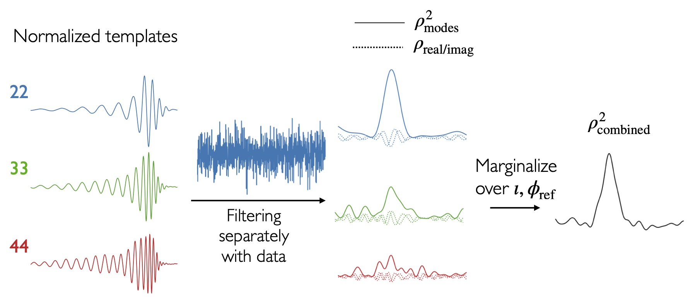

# `IAS-HM`

`IAS-HM` is a new search pipeline including higher modes (HM) or harmonics in the template bank waveforms. Nearly all of the current search pipelines do not include HM in their template banks as the computational cost increases significantly and the search can lose sensitivity if the new d.o.f are not added properly. We overcome these challenges using a new **mode-by-mode** filtering approach in our pipeline.

## Tutorial notebooks

We have provided notebooks so that you can understand the working of the pipeline and reproduce the results on public LVK strain data.

1. Template_banks.ipynb: Creating template banks from scratch.

2. Astrophysical_prior.ipynb: Generate astrophysical prior for templates and HM mode amplitude ratios using normalizing flows.

3. Trig_Coin_test_with_injection.ipynb: Using individual injections, we test the triggering module (for data pre-processing and matched filtering) and coincidence module (for collecting coincident/background candidates, performing veto tests and computing coherent statistic).

4. Trig_Coin_on_cluster.ipynb: Running the triggering and coincidence modules on bulk LVK observing run data on a computing cluster.

5. Ranking_candidates.ipynb: Combining the list of candidates from individual banks/subbanks and ranking them to calculate their false alarm rates (FAR). Just as an example, we show finding of GWC190711 in a particular ~5 hour chunk of data.

6. p_astro+detection_tables.ipynb: Calculate the p_astro and detection tables for the search.

The most up-to-date version of the notebooks can be found in [google drive](https://drive.google.com/drive/folders/15avuKxY40aX9Ru_6xkacM1ZdaGL7OgQm?usp=sharing)

## Related references

A software release paper is in prep. The following papers describe the main functionalities of the pipeline:

* Template banks: [2310.15233](https://arxiv.org/abs/2310.15233)

* Marginalization over HM SNR timeseries and non-Gaussian correction: [2405.17400](https://arxiv.org/abs/2405.17400), [2404.02435](https://arxiv.org/abs/2404.02435)

* New O3 GW candidates using our search: [2312.06631](https://arxiv.org/abs/2312.06631). Data products from the search and codes for specific modules are given [here](https://github.com/JayWadekar/GW_higher_harmonics_search).

* Search for intermediate mass-ratio inspirals: in-prep

* ML methods for astrophysical prior and non-Gaussian correction: in-prep

## Dependencies

* Required: numpy, scipy, matplotlib, scikit-learn, pandas, gsl, lal, lalsimulation,
  astropy, numba, multiprocess, [cogwheel](https://github.com/jroulet/cogwheel)

* Optional but recommended: pytorch, [lightning](https://lightning.ai/docs/pytorch/stable/starter/installation.html), [nflows](https://pypi.org/project/nflows/), corner, jupyterlab

If you are interested in more details about a particular module or want a particular functionality to be added, please feel free to email us. We'd be more than happy if you'd like to collaborate or contribute to the code, and we'd be delighted to help if needed.

## TODO

We are working on cleaning up already included modules and adding more documentation.
We also want to include the following new functionality soon:

- [ ] Include an injection module to calculate the (*VT*) senstivity of the search.

- [ ] Make the code general for passing arbitrary number of detectors, instead of the current version where only Hanford and Livingston are hardcoded.

- [ ] Three modes (22,33,44) are hard-coded in a few places. The code should be general such that user can specify an arbitrary number of ell=m modes (and possibly ell!=m modes) or perform a quadrupole-only search for comparison.

- [ ] Instead of completely removing candidates which fail veto tests, include them back with an appropriate penalty.

- [ ] Use a ML classfier to augment the detection statistic.

## Acknowledgement

We are grateful to the LVK collaboration for releasing their data and software publicly.

This research has made use of data or software obtained from the Gravitational Wave Open Science Center (gw-openscience.org), a service of LIGO Laboratory, the LIGO Scientific Collaboration, the Virgo Collaboration, and KAGRA. LIGO Laboratory and Advanced LIGO are funded by the United States National Science Foundation (NSF) as well as the Science and Technology Facilities Council (STFC) of the United Kingdom, the Max-Planck-Society (MPS), and the State of Niedersachsen/Germany for support of the construction of Advanced LIGO and construction and operation of the GEO600 detector. Additional support for Advanced LIGO was provided by the Australian Research Council. Virgo is funded, through the European Gravitational Observatory (EGO), by the French Centre National de Recherche Scientifique (CNRS), the Italian Istituto Nazionale di Fisica Nucleare (INFN) and the Dutch Nikhef, with contributions by institutions from Belgium, Germany, Greece, Hungary, Ireland, Japan, Monaco, Poland, Portugal, Spain. KAGRA is supported by Ministry of Education, Culture, Sports, Science and Technology (MEXT), Japan Society for the Promotion of Science (JSPS) in Japan; National Research Foundation (NRF) and Ministry of Science and ICT (MSIT) in Korea; Academia Sinica (AS) and National Science and Technology Council (NSTC) in Taiwan.
